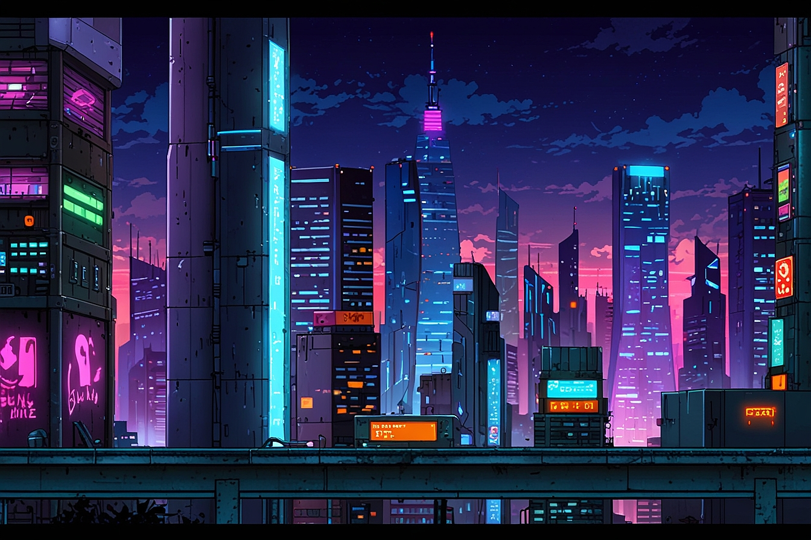

# 🦆 Cyber Duck Race 2099

> A neon-soaked, retro-futuristic duck racing game powered by React and Canvas API

[](https://opensource.org/licenses/MIT)
[](https://reactjs.org/)
[](https://vitejs.dev/)



## 🎮 Overview

**Cyber Duck Race** is a cyberpunk-themed web application where six cyber-enhanced ducks race across a scrolling neon cityscape. Built with React and rendered on HTML5 Canvas, the game features predetermined race outcomes using cryptographically secure random number generation, ensuring fair and unpredictable results.

### ✨ Features

- 🌆 **Immersive Cyberpunk Aesthetic** - Scrolling cityscape background with neon glow effects
- 🦆 **Six Unique Cyber Ducks** - NEON, CYBER, MATRIX, BLADE, GHOST, and CHROME
- 🎲 **Crypto-Secure RNG** - Fair race outcomes using Web Crypto API with Math.random fallback
- 📊 **Real-time Leaderboard** - Track race winners and statistics across sessions
- 🎨 **Dynamic Canvas Rendering** - Smooth 60 FPS animation with scrolling backgrounds
- ⚡ **Fast Development** - Built with Vite for lightning-fast HMR and builds
- 🎯 **Predetermined Winners** - Sophisticated physics engine with dynamic speed multipliers

## 🚀 Quick Start

### Prerequisites

- **Node.js** (v16 or higher)
- **npm** or **yarn**

### Installation

```bash
# Clone the repository
git clone https://github.com/subc0der/cyber-duck-race.git
cd cyber-duck-race

# Install dependencies
npm install

# Start development server
npm run dev
```

Visit **http://localhost:3000** to see the race in action!

### Build for Production

```bash
# Create optimized production build
npm run build

# Preview production build locally
npm run preview
```

## 🎯 How to Play

1. **Start the Race** - Click the "START RACE" button in the control panel
2. **Watch the Action** - Six cyber ducks race across the neon cityscape for 15 seconds
3. **See the Winner** - A modal displays the winning duck with celebratory effects
4. **Check the Leaderboard** - View race history and win counts
5. **Race Again** - Click "RESET RACE" to start over

## 🏗️ Project Structure

```
cyber-duck-race/
├── src/
│   ├── components/          # React components
│   │   ├── RaceTrack.jsx    # Canvas-based race rendering
│   │   ├── Leaderboard.jsx  # Race history and statistics
│   │   ├── ControlPanel.jsx # Race controls and status
│   │   └── WinnerModal.jsx  # Winner celebration modal
│   ├── contexts/            # React context providers
│   │   └── RaceContext.jsx  # Global race state management
│   ├── styles/              # Component-specific CSS
│   ├── utils/               # Utilities and configuration
│   │   ├── constants.js     # All configuration constants
│   │   └── racePhysics.js   # Race physics engine
│   └── App.jsx              # Main application component
├── .claude/                 # Project documentation
│   ├── coding-standards.md
│   ├── css-standards.md
│   └── context/
└── subcoder/                # Assets and resources
    └── BG00.jpg             # Cyberpunk cityscape background
```

## 🔧 Technology Stack

| Technology | Purpose |
|------------|---------|
| **React 18** | UI framework with hooks and context |
| **Vite 5** | Build tool and development server |
| **Canvas API** | High-performance race track rendering |
| **Web Crypto API** | Cryptographically secure random number generation |
| **CSS3** | Cyberpunk styling with gradients and animations |
| **ESLint + Prettier** | Code quality and formatting |

## 🎨 Design Philosophy

### Cyberpunk Aesthetic
- **Neon Color Palette**: Cyan (#00ffff), Magenta (#ff00ff), Purple (#9d00ff), Yellow (#ffff00)
- **Glowing Effects**: Box shadows and text shadows for neon glow
- **Retro-Futuristic**: Combines 80s aesthetic with modern web technologies

### Code Quality
- **No Magic Numbers**: All values extracted to `constants.js`
- **Error Handling**: Graceful degradation with fallbacks
- **Browser Compatibility**: CSS and JS fallbacks for older browsers
- **Clean Code**: Passes GitHub Copilot reviews on first attempt

## 🧪 Race Physics Engine

The game features a sophisticated physics engine (`racePhysics.js`) that:

- **Predetermines Winners**: Uses crypto-secure RNG to select winner before race starts
- **Dynamic Speed Multipliers**: Changes every 2 seconds (0.6x - 1.4x range)
- **Stage-Based Mechanics**: Different speed patterns for early/mid/late race stages
- **Smooth Animation**: 60 FPS canvas rendering with position interpolation
- **Scrolling Background**: Background moves at 300px/s while ducks stay centered

### Race Constants

```javascript
RACE_DURATION: 15,              // 15-second races
SPEED_CHANGE_INTERVAL: 2000,    // Speed changes every 2 seconds
MIN_SPEED_MULTIPLIER: 0.6,      // Minimum speed variation
MAX_SPEED_MULTIPLIER: 1.4,      // Maximum speed variation
```

## 📊 Features in Detail

### Leaderboard System
- Persistent race history (session-based)
- Win counts per duck
- Total race statistics
- Last race winner highlight

### Control Panel
- Race countdown (3, 2, 1, GO!)
- Live race status indicator
- Start/Reset controls with debouncing
- Race progress display

### Winner Modal
- Animated celebration screen
- Duck name and color
- Finish time and speed stats
- Neon-glow animations

## 🛠️ Development

### Available Scripts

```bash
npm run dev      # Start development server
npm run build    # Create production build
npm run preview  # Preview production build
npm run lint     # Run ESLint
npm run format   # Format code with Prettier
```

### Code Standards

This project follows strict coding standards to maintain quality:

- **No magic numbers** - All values in `constants.js`
- **No hardcoded paths** - File paths stored in constants
- **Error handling** - All async operations have error handlers
- **Browser compatibility** - Fallbacks for experimental features
- **Proper documentation** - See `.claude/coding-standards.md`

### Contributing Guidelines

1. Fork the repository
2. Create a feature branch (`git checkout -b feature/amazing-feature`)
3. Follow coding standards in `.claude/coding-standards.md`
4. Commit changes with conventional commits format
5. Push to your branch (`git push origin feature/amazing-feature`)
6. Open a Pull Request

## 🎯 Roadmap

### Current Features (v1.0)
- [x] Canvas-based race rendering
- [x] Six cyber ducks with unique colors
- [x] Scrolling cyberpunk cityscape
- [x] Crypto-secure winner selection
- [x] Real-time leaderboard
- [x] Winner celebration modal

### Planned Features (Future)
- [ ] Sound effects and background music
- [ ] Mobile responsive design
- [ ] Betting system (partially implemented)
- [ ] Multiplayer support
- [ ] Custom duck skins
- [ ] Achievement system
- [ ] Race replay feature

## 🐛 Known Issues

- Betting panel removed in current version (to be reimplemented)
- Audio constants defined but not yet implemented
- Session-based leaderboard (doesn't persist across page reloads)

## 📝 License

This project is licensed under the **MIT License** - see the [LICENSE](LICENSE) file for details.

## 🙏 Acknowledgments

- **Cyberpunk cityscape background** - Custom artwork for the project
- **React team** - For the amazing UI framework
- **Vite team** - For blazing fast build tooling
- **GitHub Copilot** - For code review and suggestions

## 📧 Contact

**Repository**: [https://github.com/subc0der/cyber-duck-race](https://github.com/subc0der/cyber-duck-race)

**Issues**: [https://github.com/subc0der/cyber-duck-race/issues](https://github.com/subc0der/cyber-duck-race/issues)

---

<p align="center">
  <strong>Built using React, Vite, and a whole lot of neon</strong><br>
</p>
