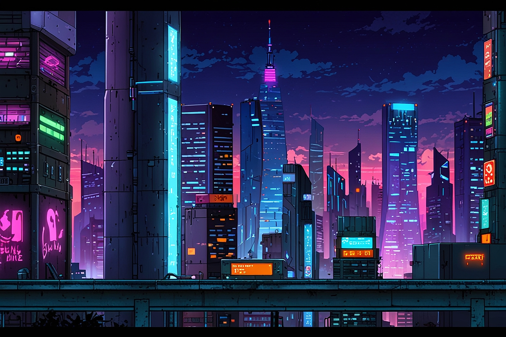

# 🦆 Cyber Duck Race 2099

> A neon-soaked, retro-futuristic duck racing game powered by React and Canvas API

[](https://opensource.org/licenses/MIT)
[](https://reactjs.org/)
[](https://vitejs.dev/)



## 🌐 Live Demo

**🚀 Try it now (no installation needed!):** [https://subc0der.github.io/cyber-duck-race/](https://subc0der.github.io/cyber-duck-race/)

Just click the link above to use the app instantly in your browser. Perfect for raffles, giveaways, and team selections!

## 🎮 Overview

**Cyber Duck Race** is a cyberpunk-themed raffle winner selection tool. Add participant names, customize your event, and watch as cyber-enhanced ducks race across a scrolling neon cityscape to randomly select a winner. Built with React and rendered on HTML5 Canvas, the app uses cryptographically secure random number generation to ensure fair and unpredictable results.

### ✨ Features

- 🎫 **Raffle Participant Management** - Add and manage participant names with visual duck assignment (up to 24)
- 🏷️ **Custom Event Naming** - Personalize your raffle with custom event titles
- 🎵 **Background Music** - Upload and play custom audio (MP3, WAV, FLAC) during races
- 🌆 **Immersive Cyberpunk Aesthetic** - Scrolling cityscape background with neon glow effects
- 🦆 **Dynamic Duck Assignment** - Each participant gets a unique cyber duck with distinct color
- 🏁 **Fair Racing Physics** - Realistic racing mechanics with unique duck characteristics (speed, acceleration, stamina)
- 📊 **Top 3 Finishers** - See 1st 🏆, 2nd 🥈, and 3rd 🥉 place after each race
- 🎨 **Dynamic Canvas Rendering** - Smooth 60 FPS animation with scrolling backgrounds
- ♿ **Accessibility** - ARIA live regions for screen readers announce race progress
- ⚡ **Fast Development** - Built with Vite for lightning-fast HMR and builds
- 🎯 **100% Fair & Random** - No predetermined winner - actual race physics determines outcomes

## 🚀 Quick Start

### For End Users (No Installation)

**Just want to use it?** Visit the live demo: [https://subc0der.github.io/cyber-duck-race/](https://subc0der.github.io/cyber-duck-race/)

No downloads, no setup - just click and go! See [USER_GUIDE.md](USER_GUIDE.md) for detailed instructions.

### For Developers

#### Prerequisites

- **Node.js** (v16 or higher)
- **npm** or **yarn**

#### Installation

```bash
# Clone the repository
git clone https://github.com/subc0der/cyber-duck-race.git
cd cyber-duck-race

# Install dependencies
npm install

# Start development server
npm run dev
```

Visit **http://localhost:3000** to see the race in action!

#### Build for Production

```bash
# Create optimized production build
npm run build

# Preview production build locally
npm run preview

# Deploy to GitHub Pages
npm run deploy
```

## 🎯 How to Use

1. **Add Participants** - Enter participant names in the Participant Manager panel (up to 24)
2. **Set Event Name** - Customize your event with a title (optional)
3. **Add Background Music** - Upload an audio file (MP3, WAV, FLAC) for atmosphere (optional)
4. **Start the Raffle** - Click "START RACE" to begin the winner selection
5. **Watch the Race** - Cyber ducks representing each participant race for 15 seconds with dynamic physics
6. **See the Winners** - A modal displays the 1st place winner with celebratory effects
7. **Check Results** - View top 3 finishers in the Race Results panel
8. **Run Another Raffle** - Click "RESET RACE" to start over

**For detailed instructions for non-developers, see [USER_GUIDE.md](USER_GUIDE.md)**

## 🏗️ Project Structure

```
cyber-duck-race/
├── src/
│   ├── components/              # React components
│   │   ├── RaceTrack.jsx        # Canvas-based race rendering
│   │   ├── ParticipantManager.jsx # Add/manage raffle participants
│   │   ├── Leaderboard.jsx      # Raffle history and statistics
│   │   ├── ControlPanel.jsx     # Race controls and status
│   │   └── WinnerModal.jsx      # Winner celebration modal
│   ├── contexts/                # React context providers
│   │   └── RaceContext.jsx      # Global race state management
│   ├── styles/                  # Component-specific CSS
│   ├── utils/                   # Utilities and configuration
│   │   ├── constants.js         # All configuration constants
│   │   └── racePhysics.js       # Race physics engine
│   └── App.jsx                  # Main application component
├── .claude/                     # Project documentation
│   ├── coding-standards.md
│   ├── css-standards.md
│   └── context/
└── subcoder/                    # Assets and resources
    └── BG00.jpg                 # Cyberpunk cityscape background
```

## 🔧 Technology Stack

| Technology | Purpose |
|------------|---------|
| **React 18** | UI framework with hooks and context |
| **Vite 5** | Build tool and development server |
| **Canvas API** | High-performance race track rendering |
| **Web Crypto API** | Cryptographically secure random number generation |
| **CSS3** | Cyberpunk styling with gradients and animations |
| **ESLint + Prettier** | Code quality and formatting |

## 🎨 Design Philosophy

### Cyberpunk Aesthetic
- **Neon Color Palette**: Cyan (#00ffff), Magenta (#ff00ff), Purple (#9d00ff), Yellow (#ffff00)
- **Glowing Effects**: Box shadows and text shadows for neon glow
- **Retro-Futuristic**: Combines 80s aesthetic with modern web technologies

### Code Quality
- **No Magic Numbers**: All values extracted to `constants.js`
- **Error Handling**: Graceful degradation with fallbacks
- **Browser Compatibility**: CSS and JS fallbacks for older browsers
- **Clean Code**: Passes GitHub Copilot reviews on first attempt

## 🧪 Fair Racing Physics Engine

The app features a sophisticated physics engine (`racePhysics.js`) that ensures fair, random racing with exciting visual dynamics:

### How It Works

- **No Predetermined Winner**: Unlike typical raffles, there's no winner selected upfront - the actual race physics determines who wins
- **Unique Duck Characteristics**: Each duck gets random stats at race start:
  - **Base Speed Factor** (0.85x - 1.15x): How naturally fast they are
  - **Acceleration** (0.08 - 0.12): How quickly they respond to speed changes
  - **Stamina** (0.7 - 1.0): Affects late-race performance
- **Dynamic Speed Changes**: Every 1-3 seconds, ducks get random speed bursts or slowdowns (±40%)
- **Stamina Effects**: After 60% of race, stamina becomes a factor (some ducks tire, others find extra gear)
- **Final Sprint Surge**: At 87-93% completion, one random 2nd-4th place duck gets a dramatic 1.5x-2.0x boost
- **Minimal Rubber-Banding**: Very slight adjustments (±5%) keep the race visually balanced without affecting fairness

### Technical Details

```javascript
// Core race parameters
RACE_DURATION: 15,                      // 15-second race
SPEED_CHANGE_MIN_INTERVAL_MS: 1000,     // Minimum 1s between speed changes
SPEED_CHANGE_MAX_INTERVAL_MS: 2000,     // Random additional 0-2s (total: 1-3s)
MIN_SPEED_MULTIPLIER: 0.4,              // Minimum speed (40%)
MAX_SPEED_MULTIPLIER: 2.0,              // Maximum speed (200%)

// Final sprint timing
FINAL_SPRINT_START: 0.87,               // 87% of race (13s mark)
FINAL_SPRINT_END: 0.93,                 // 93% of race (14s mark)
```

### Why This Approach?

1. **Truly Random**: Actual physics simulation, not predetermined outcomes
2. **Exciting to Watch**: Dramatic speed changes and final sprint surges create suspense
3. **Fair to All**: Every participant has equal probability of winning
4. **Smooth Animation**: 60 FPS canvas rendering with position interpolation
5. **Accessible**: ARIA live regions announce race progress for screen readers

## 📊 Features in Detail

### Participant Manager
- Add participant names via text input (press Enter or click ADD button)
- Visual duck color assignment (6 unique cyberpunk colors)
- Remove individual participants or clear all
- Input validation (no duplicates, no empty names)
- Maximum 30 characters per name, up to 24 participants total
- Participants persist between races until manually cleared

### Race Results Panel
- Shows top 3 finishers from current race
- 🏆 1st place with gold trophy
- 🥈 2nd place with silver medal
- 🥉 3rd place with bronze medal
- Color-coded borders matching duck colors
- Displays final position for each finisher

### Event Customization
- **Event Name**: Custom title for your raffle/event (max 100 characters)
- **Background Music**: Upload audio files (MP3, WAV, FLAC, max 150MB)
- **Audio Controls**: Play/Pause, Stop, Volume slider (0-100%), Repeat toggle
- **Collapsible Panel**: Click 🔊 icon to show/hide audio controls

### Control Panel
- Raffle countdown (3, 2, 1, GO!)
- Live race status indicator
- Start/Reset controls with debouncing
- Race progress display
- Prevents starting without participants

### Winner Modal
- Animated celebration screen
- Participant name and duck color
- Finish time and speed stats
- Neon-glow animations

## 🛠️ Development

### Available Scripts

```bash
npm run dev      # Start development server
npm run build    # Create production build
npm run preview  # Preview production build
npm run lint     # Run ESLint
npm run format   # Format code with Prettier
```

### Code Standards

This project follows strict coding standards to maintain quality:

- **No magic numbers** - All values in `constants.js`
- **No hardcoded paths** - File paths stored in constants
- **Error handling** - All async operations have error handlers
- **Browser compatibility** - Fallbacks for experimental features
- **Proper documentation** - See `.claude/coding-standards.md`

### Contributing Guidelines

1. Fork the repository
2. Create a feature branch (`git checkout -b feature/amazing-feature`)
3. Follow coding standards in `.claude/coding-standards.md`
4. Commit changes with conventional commits format
5. Push to your branch (`git push origin feature/amazing-feature`)
6. Open a Pull Request

## 🎯 Roadmap

### Current Features (v3.0)
- [x] Canvas-based race rendering with scrolling background
- [x] Dynamic participant management (up to 24)
- [x] Custom event naming
- [x] Background music support (MP3, WAV, FLAC)
- [x] Fair racing physics engine (no predetermined winner)
- [x] Top 3 finishers display
- [x] Winner celebration modal
- [x] Unique duck characteristics (speed, acceleration, stamina)
- [x] Final sprint surge mechanic
- [x] ARIA accessibility for screen readers
- [x] Dynamic lane-based positioning
- [x] Real-time race progress announcements

### Planned Features (Future)
- [ ] Sound effects (countdown beep, race start, winner fanfare)
- [ ] Mobile responsive design
- [ ] Custom duck skins/themes
- [ ] Race replay feature
- [ ] Export race results (CSV/PDF)
- [ ] Persistent storage (LocalStorage/IndexedDB)
- [ ] Multiple language support
- [ ] Race statistics and analytics
- [ ] Tournament mode (multiple rounds)

## 🐛 Known Issues

- Race history doesn't persist across page reloads (session-based only)
- Audio playback may require user interaction on some browsers (autoplay restrictions)

## 📝 License

This project is licensed under the **MIT License** - see the [LICENSE](LICENSE) file for details.

## 🙏 Acknowledgments

- **Cyberpunk cityscape background** - Custom artwork for the project
- **React team** - For the amazing UI framework
- **Vite team** - For blazing fast build tooling
- **GitHub Copilot** - For code review and suggestions

## 📧 Contact

**Repository**: [https://github.com/subc0der/cyber-duck-race](https://github.com/subc0der/cyber-duck-race)

**Issues**: [https://github.com/subc0der/cyber-duck-race/issues](https://github.com/subc0der/cyber-duck-race/issues)

---

<p align="center">
  <strong>Built using React, Vite, and a whole lot of neon</strong><br>
</p>
